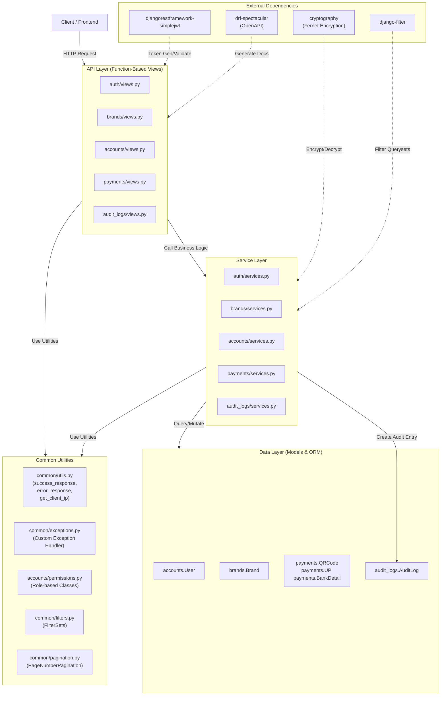
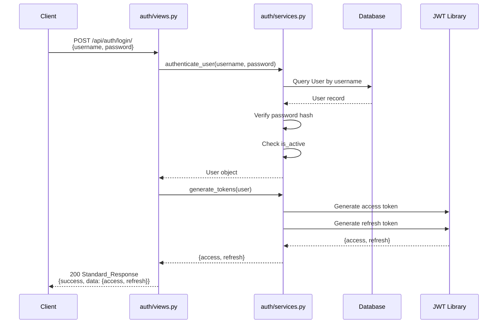
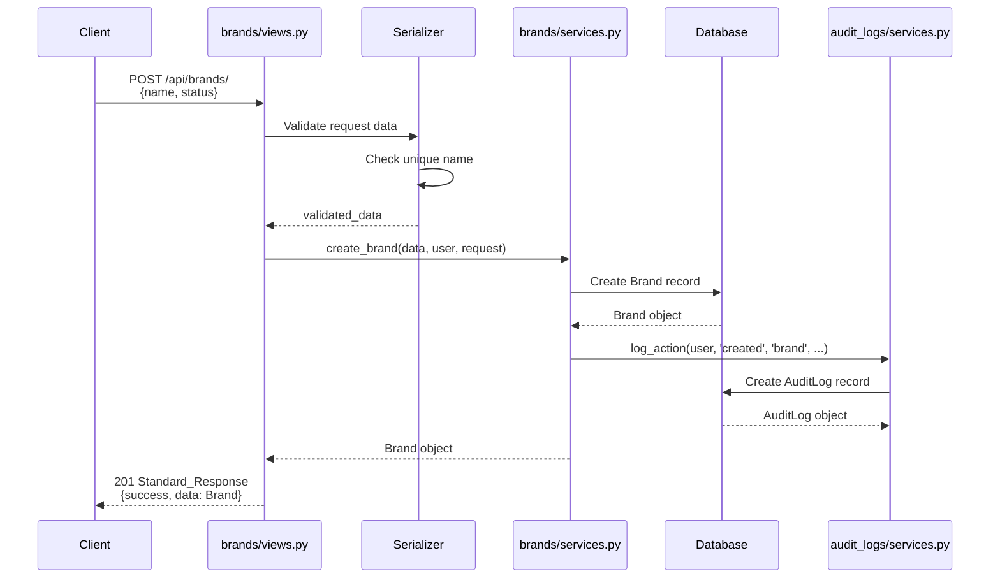
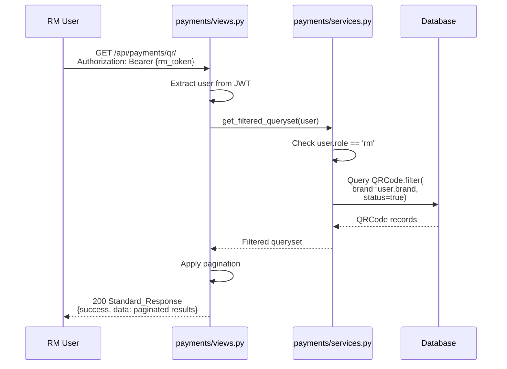
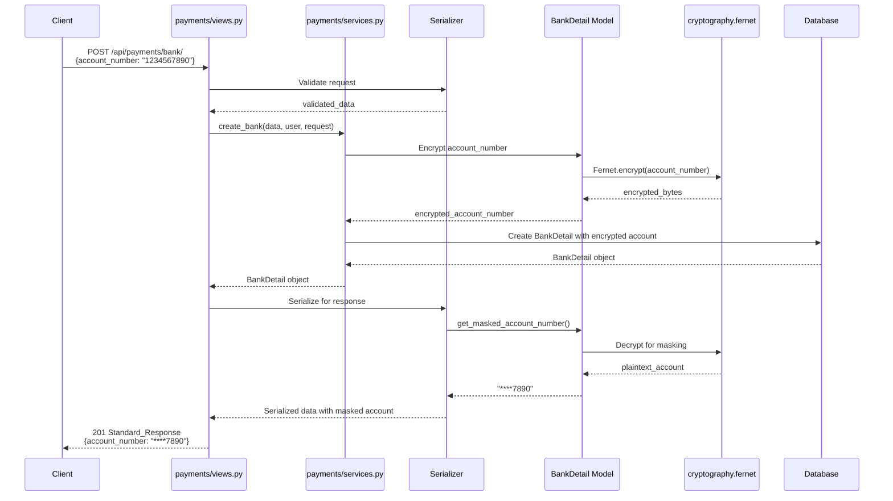

# Technical Design Document: Deposit Details Management System (DWMS) Backend API

## Overview

The Deposit Details Management System (DWMS) is a Django REST Framework-based backend API providing enterprise-grade management of deposit payment sources—QR Codes, UPI IDs, and Bank Account details. The system enforces role-based access control across three user roles (Admin, Back Office, RM), implements brand-level data isolation, and maintains complete audit trails for all data-modifying operations. The architecture follows Clean Architecture principles with thin function-based views, business logic delegated to service modules, and cryptographic security for sensitive data like bank account numbers.

**Key Design Principles:**
- Function-Based Views (FBV) exclusively—no class-based views or ViewSets
- Service Layer encapsulates all business logic, validation, and audit logging
- JWT authentication with token rotation and blacklisting
- Comprehensive audit logging on all mutations
- Brand-level filtering and isolation for RMs
- Consistent Standard_Response JSON envelope across all endpoints
- OpenAPI 3 documentation via drf-spectacular

---

## Architecture Overview



---

## Data Models Design

### 1. User Model (accounts/models.py)

```python
from django.contrib.auth.models import AbstractBaseUser, BaseUserManager
from django.db import models

class UserManager(BaseUserManager):
    """Custom manager for User model."""
    
    def create_user(self, username, email, password=None, **extra_fields):
        """Create and save a regular user."""
        if not username:
            raise ValueError("The Username field must be set")
        if not email:
            raise ValueError("The Email field must be set")
        
        email = self.normalize_email(email)
        user = self.model(username=username, email=email, **extra_fields)
        user.set_password(password)
        user.save(using=self._db)
        return user
    
    def create_superuser(self, username, email, password=None, **extra_fields):
        """Create and save a superuser."""
        extra_fields.setdefault('is_admin', True)
        extra_fields.setdefault('role', 'admin')
        return self.create_user(username, email, password, **extra_fields)


class User(AbstractBaseUser):
    """Custom User model with role-based access control."""
    
    ROLE_CHOICES = (
        ('admin', 'Admin'),
        ('back_office', 'Back Office'),
        ('rm', 'Relationship Manager'),
    )
    
    id = models.BigAutoField(primary_key=True)
    full_name = models.CharField(max_length=255)
    username = models.CharField(max_length=150, unique=True)
    email = models.EmailField(unique=True)
    mobile = models.CharField(max_length=20, blank=True)
    role = models.CharField(max_length=20, choices=ROLE_CHOICES)
    brand = models.ForeignKey(
        'brands.Brand',
        on_delete=models.SET_NULL,
        null=True,
        blank=True,
        related_name='users'
    )
    is_active = models.BooleanField(default=True)
    created_at = models.DateTimeField(auto_now_add=True)
    updated_at = models.DateTimeField(auto_now=True)
    
    objects = UserManager()
    
    USERNAME_FIELD = 'username'
    REQUIRED_FIELDS = ['email', 'full_name']
    
    class Meta:
        db_table = 'accounts_user'
        ordering = ['-created_at']
    
    def __str__(self):
        return f"{self.full_name} ({self.username})"
    
    def clean(self):
        """Validate brand requirement for RM role."""
        from django.core.exceptions import ValidationError
        if self.role == 'rm' and not self.brand:
            raise ValidationError({'brand': 'Brand is required for RM role.'})
        if self.role in ['admin', 'back_office'] and self.brand:
            raise ValidationError(
                {'brand': 'Brand should be null for admin and back_office roles.'}
            )
```

### 2. Brand Model (brands/models.py)

```python
class Brand(models.Model):
    """Brand model representing organizational entities."""
    
    id = models.BigAutoField(primary_key=True)
    name = models.CharField(max_length=100, unique=True)
    status = models.BooleanField(default=True)  # True=active, False=inactive
    created_at = models.DateTimeField(auto_now_add=True)
    updated_at = models.DateTimeField(auto_now=True)
    
    class Meta:
        db_table = 'brands_brand'
        ordering = ['name']
    
    def __str__(self):
        return f"{self.name} ({'Active' if self.status else 'Inactive'})"
```

### 3. Payment Source Models (payments/models.py)

```python
from django.db import models
from django.core.validators import DecimalValidator, RegexValidator
from cryptography.fernet import Fernet
from django.conf import settings

class QRCode(models.Model):
    """QR Code payment source model."""
    
    id = models.BigAutoField(primary_key=True)
    qr_name = models.CharField(max_length=200)
    qr_image = models.FileField(upload_to='qr_codes/')
    brand = models.ForeignKey(
        'brands.Brand',
        on_delete=models.CASCADE,
        related_name='qr_codes'
    )
    range_from = models.DecimalField(
        max_digits=12,
        decimal_places=2,
        validators=[DecimalValidator(12, 2)]
    )
    range_to = models.DecimalField(
        max_digits=12,
        decimal_places=2,
        validators=[DecimalValidator(12, 2)]
    )
    status = models.BooleanField(default=True)
    created_by = models.ForeignKey(
        'accounts.User',
        on_delete=models.SET_NULL,
        null=True,
        related_name='qr_codes_created'
    )
    created_at = models.DateTimeField(auto_now_add=True)
    updated_at = models.DateTimeField(auto_now=True)
    
    class Meta:
        db_table = 'payments_qrcode'
        ordering = ['-created_at']
    
    def __str__(self):
        return f"QR: {self.qr_name} ({self.brand.name})"
    
    def clean(self):
        from django.core.exceptions import ValidationError
        if self.range_from >= self.range_to:
            raise ValidationError(
                {'range_from': 'range_from must be less than range_to.'}
            )


class UPI(models.Model):
    """UPI payment source model."""
    
    id = models.BigAutoField(primary_key=True)
    upi_id = models.CharField(
        max_length=100,
        unique=True,
        validators=[
            RegexValidator(
                regex=r'^[a-zA-Z0-9.\-_]{2,256}@[a-zA-Z]{2,64}$',
                message='Invalid UPI ID format.'
            )
        ]
    )
    brand = models.ForeignKey(
        'brands.Brand',
        on_delete=models.CASCADE,
        related_name='upi_records'
    )
    range_from = models.DecimalField(
        max_digits=12,
        decimal_places=2,
        validators=[DecimalValidator(12, 2)]
    )
    range_to = models.DecimalField(
        max_digits=12,
        decimal_places=2,
        validators=[DecimalValidator(12, 2)]
    )
    status = models.BooleanField(default=True)
    created_by = models.ForeignKey(
        'accounts.User',
        on_delete=models.SET_NULL,
        null=True,
        related_name='upi_records_created'
    )
    created_at = models.DateTimeField(auto_now_add=True)
    updated_at = models.DateTimeField(auto_now=True)
    
    class Meta:
        db_table = 'payments_upi'
        ordering = ['-created_at']
    
    def __str__(self):
        return f"UPI: {self.upi_id} ({self.brand.name})"
    
    def clean(self):
        from django.core.exceptions import ValidationError
        if self.range_from >= self.range_to:
            raise ValidationError(
                {'range_from': 'range_from must be less than range_to.'}
            )


class BankDetail(models.Model):
    """Bank Detail payment source model with encrypted account number."""
    
    id = models.BigAutoField(primary_key=True)
    bank_name = models.CharField(max_length=200)
    account_holder_name = models.CharField(max_length=200)
    account_number = models.CharField(max_length=255)  # Stored encrypted
    ifsc_code = models.CharField(
        max_length=11,
        validators=[
            RegexValidator(
                regex=r'^[A-Z]{4}0[A-Z0-9]{6}$',
                message='Invalid IFSC code format. Expected format: ABCD0123456.'
            )
        ]
    )
    branch_name = models.CharField(max_length=200)
    brand = models.ForeignKey(
        'brands.Brand',
        on_delete=models.CASCADE,
        related_name='bank_details'
    )
    range_from = models.DecimalField(
        max_digits=12,
        decimal_places=2,
        validators=[DecimalValidator(12, 2)]
    )
    range_to = models.DecimalField(
        max_digits=12,
        decimal_places=2,
        validators=[DecimalValidator(12, 2)]
    )
    status = models.BooleanField(default=True)
    created_by = models.ForeignKey(
        'accounts.User',
        on_delete=models.SET_NULL,
        null=True,
        related_name='bank_details_created'
    )
    created_at = models.DateTimeField(auto_now_add=True)
    updated_at = models.DateTimeField(auto_now=True)
    
    class Meta:
        db_table = 'payments_bankdetail'
        ordering = ['-created_at']
    
    def __str__(self):
        return f"Bank: {self.bank_name} ({self.brand.name})"
    
    def clean(self):
        from django.core.exceptions import ValidationError
        if self.range_from >= self.range_to:
            raise ValidationError(
                {'range_from': 'range_from must be less than range_to.'}
            )
    
    @staticmethod
    def _get_cipher_suite():
        """Get cipher suite for encryption/decryption."""
        encryption_key = settings.ENCRYPTION_KEY.encode()
        return Fernet(encryption_key)
    
    def encrypt_account_number(self, account_number):
        """Encrypt account number before storage."""
        cipher_suite = self._get_cipher_suite()
        return cipher_suite.encrypt(account_number.encode()).decode()
    
    def decrypt_account_number(self):
        """Decrypt and return the plaintext account number."""
        cipher_suite = self._get_cipher_suite()
        return cipher_suite.decrypt(self.account_number.encode()).decode()
    
    def get_masked_account_number(self):
        """Return account number with only last 4 digits visible."""
        decrypted = self.decrypt_account_number()
        return f"{'*' * (len(decrypted) - 4)}{decrypted[-4:]}"
```

### 4. Audit Log Model (audit_logs/models.py)

```python
from django.db import models

class AuditLog(models.Model):
    """Immutable audit log for tracking all data modifications."""
    
    ACTION_CHOICES = (
        ('created', 'Created'),
        ('updated', 'Updated'),
        ('deleted', 'Deleted'),
        ('activated', 'Activated'),
        ('deactivated', 'Deactivated'),
    )
    
    MODULE_CHOICES = (
        ('brand', 'Brand'),
        ('user', 'User'),
        ('qr', 'QR Code'),
        ('upi', 'UPI'),
        ('bank', 'Bank Detail'),
    )
    
    id = models.BigAutoField(primary_key=True)
    user = models.ForeignKey(
        'accounts.User',
        on_delete=models.SET_NULL,
        null=True,
        related_name='audit_logs'
    )
    action = models.CharField(max_length=20, choices=ACTION_CHOICES)
    module = models.CharField(max_length=20, choices=MODULE_CHOICES)
    object_id = models.BigIntegerField()
    old_data = models.JSONField(null=True, blank=True)
    new_data = models.JSONField(null=True, blank=True)
    ip_address = models.CharField(max_length=45)  # Supports IPv4 and IPv6
    timestamp = models.DateTimeField(auto_now_add=True)
    
    # Immutability: all fields are read-only
    class Meta:
        db_table = 'audit_logs_auditlog'
        ordering = ['-timestamp']
        indexes = [
            models.Index(fields=['-timestamp']),
            models.Index(fields=['module', '-timestamp']),
            models.Index(fields=['user', '-timestamp']),
        ]
    
    def __str__(self):
        return f"{self.get_action_display()} {self.get_module_display()} #{self.object_id}"
    
    def save(self, *args, **kwargs):
        """Prevent updates to audit log records."""
        if self.pk is not None:
            raise Exception("AuditLog records are immutable and cannot be updated.")
        super().save(*args, **kwargs)
    
    def delete(self, *args, **kwargs):
        """Prevent deletion of audit log records."""
        raise Exception("AuditLog records cannot be deleted.")
```


---

## Authentication and JWT Configuration

### JWT Token Configuration (config/settings.py)

```python
from datetime import timedelta

SIMPLE_JWT = {
    'ACCESS_TOKEN_LIFETIME': timedelta(minutes=60),
    'REFRESH_TOKEN_LIFETIME': timedelta(days=7),
    'ROTATE_REFRESH_TOKENS': True,
    'BLACKLIST_AFTER_ROTATION': True,
    'UPDATE_LAST_LOGIN': False,
    
    'ALGORITHM': 'HS256',
    'SIGNING_KEY': SECRET_KEY,
    'VERIFYING_KEY': None,
    'AUDIENCE': None,
    'ISSUER': None,
    'JTI_CLAIM': 'jti',
    'TOKEN_TYPE_CLAIM': 'token_type',
    'JTI_URL_ARGUMENT_NAME': 'jti',
    'SLIDING_TOKEN_REFRESH_EXP_CLAIM': 'refresh_exp',
    'SLIDING_TOKEN_LIFETIME': timedelta(days=7),
    'SLIDING_TOKEN_REFRESH_LIFETIME': timedelta(days=14),
}
```

### Authentication Endpoints Flow

**POST /api/auth/login/**
- Accepts: `{"username": "string", "password": "string"}`
- Validates credentials and user active status
- Returns: `{"access": "jwt_token", "refresh": "jwt_token"}`
- Status codes: 200 (success), 401 (invalid/inactive), 400 (validation error)

**POST /api/auth/refresh/**
- Accepts: `{"refresh": "jwt_token"}`
- Generates new access token, rotates refresh token
- Returns: `{"access": "new_jwt_token", "refresh": "new_jwt_token"}`
- Status codes: 200 (success), 401 (blacklisted/invalid)

**POST /api/auth/logout/**
- Accepts: `{"refresh": "jwt_token"}`
- Blacklists the refresh token
- Returns: success message
- Status codes: 200 (success), 400 (validation error)

**POST /api/auth/change-password/**
- Requires: JWT access token (Authorization: Bearer {token})
- Accepts: `{"old_password": "string", "new_password": "string", "confirm_new_password": "string"}`
- Validates old password, matches new passwords, passes Django validators
- Returns: success message
- Status codes: 200 (success), 400 (validation error), 401 (unauthorized)

---

## Permission Classes Design (accounts/permissions.py)

```python
from rest_framework.permissions import BasePermission

class IsAdmin(BasePermission):
    """Allow access only to Admin users."""
    message = "You do not have permission to perform this action. Admin access required."
    
    def has_permission(self, request, view):
        return (
            request.user and
            request.user.is_authenticated and
            request.user.role == 'admin'
        )


class IsBackOffice(BasePermission):
    """Allow access only to Back Office users."""
    message = "You do not have permission to perform this action. Back Office access required."
    
    def has_permission(self, request, view):
        return (
            request.user and
            request.user.is_authenticated and
            request.user.role == 'back_office'
        )


class IsAdminOrBackOffice(BasePermission):
    """Allow access to Admin or Back Office users."""
    message = "You do not have permission to perform this action. Admin or Back Office access required."
    
    def has_permission(self, request, view):
        return (
            request.user and
            request.user.is_authenticated and
            request.user.role in ['admin', 'back_office']
        )


class IsRM(BasePermission):
    """Allow access only to Relationship Manager users."""
    message = "You do not have permission to perform this action. RM access required."
    
    def has_permission(self, request, view):
        return (
            request.user and
            request.user.is_authenticated and
            request.user.role == 'rm'
        )


class IsAdminOrBackOfficeOrRM(BasePermission):
    """Allow access to any authenticated user (Admin, Back Office, or RM)."""
    
    def has_permission(self, request, view):
        return request.user and request.user.is_authenticated
```

---

## Common Utilities Design

### standard Response Format (common/utils.py)

```python
from rest_framework.response import Response
from rest_framework import status

def success_response(
    message,
    data=None,
    status_code=status.HTTP_200_OK
):
    """
    Generate a standard success response.
    
    Args:
        message (str): Success message
        data (any): Response payload
        status_code (int): HTTP status code
    
    Returns:
        Response: DRF Response object with standard envelope
    """
    return Response(
        {
            "success": True,
            "message": message,
            "data": data,
            "errors": None
        },
        status=status_code
    )


def error_response(
    message,
    errors=None,
    status_code=status.HTTP_400_BAD_REQUEST
):
    """
    Generate a standard error response.
    
    Args:
        message (str): Error message
        errors (dict): Field-level error mapping
        status_code (int): HTTP status code
    
    Returns:
        Response: DRF Response object with standard envelope
    """
    return Response(
        {
            "success": False,
            "message": message,
            "data": None,
            "errors": errors or {}
        },
        status=status_code
    )


def get_client_ip(request):
    """
    Extract client IP address from request.
    Handles X-Forwarded-For header for proxied requests.
    
    Args:
        request: Django request object
    
    Returns:
        str: Client IP address
    """
    x_forwarded_for = request.META.get('HTTP_X_FORWARDED_FOR')
    if x_forwarded_for:
        ip = x_forwarded_for.split(',')[0].strip()
    else:
        ip = request.META.get('REMOTE_ADDR', '')
    
    return ip[:45]  # Max 45 chars for IPv4 and IPv6
```

### Exception Handler (common/exceptions.py)

```python
from rest_framework.views import exception_handler
from rest_framework.exceptions import (
    ValidationError,
    AuthenticationFailed,
    NotAuthenticated,
    PermissionDenied,
    NotFound
)
from django.db import IntegrityError
from rest_framework import status
from .utils import error_response

def custom_exception_handler(exc, context):
    """
    Custom exception handler that enforces Standard_Response format.
    """
    
    if isinstance(exc, ValidationError):
        return error_response(
            message="Validation failed.",
            errors=exc.detail if isinstance(exc.detail, dict) else {"detail": exc.detail},
            status_code=status.HTTP_400_BAD_REQUEST
        )
    
    if isinstance(exc, (AuthenticationFailed, NotAuthenticated)):
        return error_response(
            message="Authentication failed. Please provide valid credentials.",
            status_code=status.HTTP_401_UNAUTHORIZED
        )
    
    if isinstance(exc, PermissionDenied):
        return error_response(
            message="You do not have permission to perform this action.",
            status_code=status.HTTP_403_FORBIDDEN
        )
    
    if isinstance(exc, NotFound):
        return error_response(
            message="The requested resource was not found.",
            status_code=status.HTTP_404_NOT_FOUND
        )
    
    if isinstance(exc, IntegrityError):
        return error_response(
            message="A record with this data already exists.",
            status_code=status.HTTP_409_CONFLICT
        )
    
    # Fallback to default handler for other exceptions
    response = exception_handler(exc, context)
    
    if response is None:
        # Unhandled exception
        return error_response(
            message="An unexpected error occurred.",
            status_code=status.HTTP_500_INTERNAL_SERVER_ERROR
        )
    
    return response
```


---

## Serializers Design

### Brand Serializers (brands/serializers.py)

```python
from rest_framework import serializers
from brands.models import Brand

class BrandCreateUpdateSerializer(serializers.ModelSerializer):
    """Serializer for creating and updating brands."""
    
    class Meta:
        model = Brand
        fields = ['id', 'name', 'status']
    
    def validate_name(self, value):
        """Ensure unique brand name."""
        existing = Brand.objects.filter(name=value)
        if self.instance:
            existing = existing.exclude(id=self.instance.id)
        if existing.exists():
            raise serializers.ValidationError("A brand with this name already exists.")
        return value


class BrandListSerializer(serializers.ModelSerializer):
    """Serializer for listing brands."""
    
    class Meta:
        model = Brand
        fields = ['id', 'name', 'status', 'created_at', 'updated_at']


class BrandDetailSerializer(serializers.ModelSerializer):
    """Serializer for brand detail view."""
    
    class Meta:
        model = Brand
        fields = ['id', 'name', 'status', 'created_at', 'updated_at']
```

### User Serializers (accounts/serializers.py)

```python
from rest_framework import serializers
from accounts.models import User

class UserCreateSerializer(serializers.ModelSerializer):
    """Serializer for creating users."""
    password = serializers.CharField(write_only=True, min_length=8)
    confirm_password = serializers.CharField(write_only=True, required=False)
    
    class Meta:
        model = User
        fields = ['id', 'full_name', 'username', 'email', 'mobile', 'role', 'brand', 'password', 'confirm_password']
    
    def validate(self, data):
        """Validate brand requirement for RM role."""
        role = data.get('role')
        brand = data.get('brand')
        
        if role == 'rm' and not brand:
            raise serializers.ValidationError({'brand': 'Brand is required for RM role.'})
        
        if role in ['admin', 'back_office'] and brand:
            raise serializers.ValidationError({'brand': 'Brand should be null for admin and back_office roles.'})
        
        return data
    
    def create(self, validated_data):
        validated_data.pop('confirm_password', None)
        password = validated_data.pop('password')
        user = User.objects.create_user(**validated_data, password=password)
        return user


class UserUpdateSerializer(serializers.ModelSerializer):
    """Serializer for updating users."""
    
    class Meta:
        model = User
        fields = ['id', 'full_name', 'username', 'email', 'mobile', 'role', 'brand', 'is_active']
    
    def validate(self, data):
        """Validate brand requirement for RM role."""
        role = data.get('role', self.instance.role)
        brand = data.get('brand', self.instance.brand)
        
        if role == 'rm' and not brand:
            raise serializers.ValidationError({'brand': 'Brand is required for RM role.'})
        
        if role in ['admin', 'back_office'] and brand:
            raise serializers.ValidationError({'brand': 'Brand should be null for admin and back_office roles.'})
        
        return data


class UserListSerializer(serializers.ModelSerializer):
    """Serializer for listing users (excludes password)."""
    
    class Meta:
        model = User
        fields = ['id', 'full_name', 'username', 'email', 'mobile', 'role', 'brand', 'is_active', 'created_at', 'updated_at']


class UserDetailSerializer(serializers.ModelSerializer):
    """Serializer for user detail view (excludes password)."""
    
    class Meta:
        model = User
        fields = ['id', 'full_name', 'username', 'email', 'mobile', 'role', 'brand', 'is_active', 'created_at', 'updated_at']


class ChangePasswordSerializer(serializers.Serializer):
    """Serializer for password change endpoint."""
    old_password = serializers.CharField(write_only=True)
    new_password = serializers.CharField(write_only=True, min_length=8)
    confirm_new_password = serializers.CharField(write_only=True, min_length=8)
    
    def validate(self, data):
        """Validate matching new passwords."""
        if data['new_password'] != data['confirm_new_password']:
            raise serializers.ValidationError({'new_password': 'Passwords do not match.'})
        return data


class ResetPasswordSerializer(serializers.Serializer):
    """Serializer for admin password reset endpoint."""
    new_password = serializers.CharField(write_only=True, min_length=8)
```

### Payment Source Serializers (payments/serializers.py)

```python
from rest_framework import serializers
from payments.models import QRCode, UPI, BankDetail

class QRCodeCreateUpdateSerializer(serializers.ModelSerializer):
    """Serializer for creating and updating QR codes."""
    
    class Meta:
        model = QRCode
        fields = ['id', 'qr_name', 'qr_image', 'brand', 'range_from', 'range_to', 'status']
    
    def validate_qr_image(self, value):
        """Validate QR image file type and size."""
        allowed_types = ['image/jpeg', 'image/png', 'image/gif', 'image/webp']
        if value.content_type not in allowed_types:
            raise serializers.ValidationError("Unsupported file type. Allowed: jpg, jpeg, png, gif, webp.")
        
        if value.size > 5 * 1024 * 1024:  # 5 MB
            raise serializers.ValidationError("File size must not exceed 5 MB.")
        
        return value
    
    def validate(self, data):
        """Validate range values."""
        if data.get('range_from') >= data.get('range_to'):
            raise serializers.ValidationError({'range_from': 'range_from must be less than range_to.'})
        return data


class QRCodeListSerializer(serializers.ModelSerializer):
    """Serializer for listing QR codes."""
    
    class Meta:
        model = QRCode
        fields = ['id', 'qr_name', 'qr_image', 'brand', 'range_from', 'range_to', 'status', 'created_at']


class QRCodeDetailSerializer(serializers.ModelSerializer):
    """Serializer for QR code detail view."""
    
    class Meta:
        model = QRCode
        fields = ['id', 'qr_name', 'qr_image', 'brand', 'range_from', 'range_to', 'status', 'created_by', 'created_at', 'updated_at']


class UPICreateUpdateSerializer(serializers.ModelSerializer):
    """Serializer for creating and updating UPI records."""
    
    class Meta:
        model = UPI
        fields = ['id', 'upi_id', 'brand', 'range_from', 'range_to', 'status']
    
    def validate(self, data):
        """Validate range values."""
        if data.get('range_from') >= data.get('range_to'):
            raise serializers.ValidationError({'range_from': 'range_from must be less than range_to.'})
        return data


class UPIListSerializer(serializers.ModelSerializer):
    """Serializer for listing UPI records."""
    
    class Meta:
        model = UPI
        fields = ['id', 'upi_id', 'brand', 'range_from', 'range_to', 'status', 'created_at']


class UPIDetailSerializer(serializers.ModelSerializer):
    """Serializer for UPI detail view."""
    
    class Meta:
        model = UPI
        fields = ['id', 'upi_id', 'brand', 'range_from', 'range_to', 'status', 'created_by', 'created_at', 'updated_at']


class BankDetailCreateUpdateSerializer(serializers.ModelSerializer):
    """Serializer for creating and updating bank details."""
    account_number = serializers.CharField(write_only=True)  # Accept plaintext, encrypt in service
    
    class Meta:
        model = BankDetail
        fields = ['id', 'bank_name', 'account_holder_name', 'account_number', 'ifsc_code', 'branch_name', 'brand', 'range_from', 'range_to', 'status']
    
    def validate(self, data):
        """Validate range values."""
        if data.get('range_from') >= data.get('range_to'):
            raise serializers.ValidationError({'range_from': 'range_from must be less than range_to.'})
        return data


class BankDetailListSerializer(serializers.ModelSerializer):
    """Serializer for listing bank details (with masked account number)."""
    masked_account_number = serializers.SerializerMethodField()
    
    class Meta:
        model = BankDetail
        fields = ['id', 'bank_name', 'account_holder_name', 'masked_account_number', 'ifsc_code', 'branch_name', 'brand', 'range_from', 'range_to', 'status', 'created_at']
    
    def get_masked_account_number(self, obj):
        return obj.get_masked_account_number()


class BankDetailDetailSerializer(serializers.ModelSerializer):
    """Serializer for bank detail view (with masked account number)."""
    masked_account_number = serializers.SerializerMethodField()
    
    class Meta:
        model = BankDetail
        fields = ['id', 'bank_name', 'account_holder_name', 'masked_account_number', 'ifsc_code', 'branch_name', 'brand', 'range_from', 'range_to', 'status', 'created_by', 'created_at', 'updated_at']
    
    def get_masked_account_number(self, obj):
        return obj.get_masked_account_number()
```

### Audit Log Serializer (audit_logs/serializers.py)

```python
from rest_framework import serializers
from audit_logs.models import AuditLog

class AuditLogSerializer(serializers.ModelSerializer):
    """Serializer for audit log listing."""
    
    user_full_name = serializers.CharField(source='user.full_name', read_only=True)
    user_username = serializers.CharField(source='user.username', read_only=True)
    action_display = serializers.CharField(source='get_action_display', read_only=True)
    module_display = serializers.CharField(source='get_module_display', read_only=True)
    
    class Meta:
        model = AuditLog
        fields = ['id', 'user', 'user_full_name', 'user_username', 'action', 'action_display', 'module', 'module_display', 'object_id', 'old_data', 'new_data', 'ip_address', 'timestamp']
        read_only_fields = fields  # All fields are immutable
```


---

## Service Layer Design

### Authentication Service (accounts/services.py - Auth Section)

```python
from django.contrib.auth import authenticate
from rest_framework_simplejwt.tokens import RefreshToken
from accounts.models import User
from common.exceptions import ValidationError

class AuthService:
    """Service for handling authentication operations."""
    
    @staticmethod
    def authenticate_user(username, password):
        """
        Authenticate user with username and password.
        
        Precondition:
        - username and password are non-null strings
        
        Postcondition:
        - On success: returns User object if valid credentials and account is active
        - On failure: raises ValidationError with descriptive message
        """
        user = authenticate(username=username, password=password)
        
        if not user:
            raise ValidationError({'detail': 'Invalid username or password.'})
        
        if not user.is_active:
            raise ValidationError({'detail': 'Your account has been deactivated.'})
        
        return user
    
    @staticmethod
    def generate_tokens(user):
        """
        Generate access and refresh JWT tokens for user.
        
        Postcondition:
        - Returns dict with 'access' and 'refresh' token strings
        - Tokens are signed with configured SECRET_KEY
        """
        refresh = RefreshToken.for_user(user)
        return {
            'refresh': str(refresh),
            'access': str(refresh.access_token),
        }
    
    @staticmethod
    def validate_refresh_token(refresh_token):
        """
        Validate and refresh an access token.
        
        Postcondition:
        - On success: returns new access token
        - On failure: raises ValidationError if token is blacklisted or invalid
        """
        try:
            refresh = RefreshToken(refresh_token)
            return {'access': str(refresh.access_token)}
        except Exception as e:
            raise ValidationError({'detail': 'Invalid or blacklisted refresh token.'})
    
    @staticmethod
    def logout_user(refresh_token):
        """
        Blacklist refresh token on logout.
        
        Postcondition:
        - Token is added to blacklist, preventing future use
        """
        try:
            refresh = RefreshToken(refresh_token)
            refresh.blacklist()
            return True
        except Exception:
            raise ValidationError({'detail': 'Invalid refresh token.'})
    
    @staticmethod
    def change_password(user, old_password, new_password):
        """
        Change user password after validating old password.
        
        Precondition:
        - user is authenticated
        - old_password matches current password
        - new_password passes all Django validators
        
        Postcondition:
        - User's password is updated to new_password
        """
        if not user.check_password(old_password):
            raise ValidationError({'old_password': 'Old password is incorrect.'})
        
        user.set_password(new_password)
        user.full_clean()  # Trigger password validators
        user.save()
        return user
```

### Brand Service (brands/services.py)

```python
from brands.models import Brand
from audit_logs.services import AuditService
from common.utils import get_client_ip

class BrandService:
    """Service for brand operations."""
    
    @staticmethod
    def create_brand(data, user, request):
        """
        Create a new brand.
        
        Postcondition:
        - Brand record is created and persisted
        - AuditLog entry is created with 'created' action
        """
        brand = Brand.objects.create(**data)
        
        AuditService.log_action(
            user=user,
            action='created',
            module='brand',
            object_id=brand.id,
            new_data=BrandSerializer(brand).data,
            ip_address=get_client_ip(request)
        )
        
        return brand
    
    @staticmethod
    def update_brand(brand_id, data, user, request):
        """
        Update existing brand.
        
        Postcondition:
        - Brand record is updated with provided data
        - AuditLog entry captures old_data and new_data
        """
        brand = Brand.objects.get(id=brand_id)
        old_data = BrandSerializer(brand).data
        
        for key, value in data.items():
            setattr(brand, key, value)
        brand.save()
        
        new_data = BrandSerializer(brand).data
        
        AuditService.log_action(
            user=user,
            action='updated',
            module='brand',
            object_id=brand.id,
            old_data=old_data,
            new_data=new_data,
            ip_address=get_client_ip(request)
        )
        
        return brand
    
    @staticmethod
    def delete_brand(brand_id, user, request):
        """
        Delete (deactivate) a brand.
        
        Postcondition:
        - Brand's status is set to False (deactivated)
        - AuditLog entry is created with 'deleted' action
        """
        brand = Brand.objects.get(id=brand_id)
        old_data = BrandSerializer(brand).data
        
        brand.status = False
        brand.save()
        
        new_data = BrandSerializer(brand).data
        
        AuditService.log_action(
            user=user,
            action='deleted',
            module='brand',
            object_id=brand.id,
            old_data=old_data,
            new_data=new_data,
            ip_address=get_client_ip(request)
        )
        
        return brand
    
    @staticmethod
    def activate_brand(brand_id, user, request):
        """Set brand status to active."""
        brand = Brand.objects.get(id=brand_id)
        old_data = BrandSerializer(brand).data
        
        brand.status = True
        brand.save()
        
        new_data = BrandSerializer(brand).data
        
        AuditService.log_action(
            user=user,
            action='activated',
            module='brand',
            object_id=brand.id,
            old_data=old_data,
            new_data=new_data,
            ip_address=get_client_ip(request)
        )
        
        return brand
    
    @staticmethod
    def deactivate_brand(brand_id, user, request):
        """Set brand status to inactive."""
        brand = Brand.objects.get(id=brand_id)
        old_data = BrandSerializer(brand).data
        
        brand.status = False
        brand.save()
        
        new_data = BrandSerializer(brand).data
        
        AuditService.log_action(
            user=user,
            action='deactivated',
            module='brand',
            object_id=brand.id,
            old_data=old_data,
            new_data=new_data,
            ip_address=get_client_ip(request)
        )
        
        return brand
```

### Payment Service (payments/services.py - QR Section)

```python
from payments.models import QRCode, UPI, BankDetail
from audit_logs.services import AuditService
from common.utils import get_client_ip
import uuid
import os

class QRCodeService:
    """Service for QR code payment source operations."""
    
    @staticmethod
    def create_qr(data, user, request):
        """
        Create a new QR code payment source.
        
        Postcondition:
        - QR image file is stored with UUID-prefixed filename
        - QRCode record is created with created_by=user
        - AuditLog entry is created
        """
        # Handle file upload with UUID prefix
        qr_image = data.pop('qr_image')
        file_ext = os.path.splitext(qr_image.name)[1]
        unique_filename = f"{uuid.uuid4()}{file_ext}"
        
        qr_image.name = unique_filename
        
        qr = QRCode.objects.create(
            qr_image=qr_image,
            created_by=user,
            **data
        )
        
        AuditService.log_action(
            user=user,
            action='created',
            module='qr',
            object_id=qr.id,
            new_data=QRCodeDetailSerializer(qr).data,
            ip_address=get_client_ip(request)
        )
        
        return qr
    
    @staticmethod
    def get_filtered_queryset(user):
        """
        Get QR codes with filtering based on user role.
        
        Postcondition:
        - Admin/Back Office: all QRCode records
        - RM: only active QRCode records for RM's assigned brand
        """
        queryset = QRCode.objects.all()
        
        if user.role == 'rm':
            queryset = queryset.filter(
                brand=user.brand,
                status=True
            )
        
        return queryset
    
    @staticmethod
    def delete_qr(qr_id, user, request):
        """
        Delete QR code and associated image file.
        
        Postcondition:
        - QRCode record is deleted
        - Image file is removed from storage
        - AuditLog entry is created
        """
        qr = QRCode.objects.get(id=qr_id)
        old_data = QRCodeDetailSerializer(qr).data
        
        # Delete file from storage
        if qr.qr_image:
            qr.qr_image.delete(save=False)
        
        qr.delete()
        
        AuditService.log_action(
            user=user,
            action='deleted',
            module='qr',
            object_id=qr_id,
            old_data=old_data,
            new_data=None,
            ip_address=get_client_ip(request)
        )
```

### Audit Service (audit_logs/services.py)

```python
from audit_logs.models import AuditLog
from django.core.serializers.json import DjangoJSONEncoder
import json

class AuditService:
    """Service for audit log operations."""
    
    @staticmethod
    def log_action(user, action, module, object_id, old_data=None, new_data=None, ip_address=''):
        """
        Create an audit log entry.
        
        Precondition:
        - action is one of: created, updated, deleted, activated, deactivated
        - module is one of: brand, user, qr, upi, bank
        - object_id is valid primary key of affected record
        - ip_address is extracted from request
        
        Postcondition:
        - AuditLog record is created and persisted
        - Record is immutable (cannot be updated or deleted)
        """
        AuditLog.objects.create(
            user=user,
            action=action,
            module=module,
            object_id=object_id,
            old_data=old_data,
            new_data=new_data,
            ip_address=ip_address
        )
```


---

## Filtering and Pagination Design

### FilterSets (common/filters.py)

```python
from django_filters import FilterSet, CharFilter, BooleanFilter, NumberFilter, DateFromToRangeFilter
from brands.models import Brand
from accounts.models import User
from payments.models import QRCode, UPI, BankDetail
from audit_logs.models import AuditLog

class BrandFilter(FilterSet):
    """FilterSet for Brand model."""
    name = CharFilter(field_name='name', lookup_expr='icontains')
    
    class Meta:
        model = Brand
        fields = ['status', 'name']


class UserFilter(FilterSet):
    """FilterSet for User model."""
    full_name = CharFilter(field_name='full_name', lookup_expr='icontains')
    username = CharFilter(field_name='username', lookup_expr='icontains')
    email = CharFilter(field_name='email', lookup_expr='icontains')
    
    class Meta:
        model = User
        fields = ['role', 'brand', 'is_active']


class QRCodeFilter(FilterSet):
    """FilterSet for QRCode model."""
    qr_name = CharFilter(field_name='qr_name', lookup_expr='icontains')
    range_from_min = NumberFilter(field_name='range_from', lookup_expr='gte')
    range_from_max = NumberFilter(field_name='range_from', lookup_expr='lte')
    range_to_min = NumberFilter(field_name='range_to', lookup_expr='gte')
    range_to_max = NumberFilter(field_name='range_to', lookup_expr='lte')
    
    class Meta:
        model = QRCode
        fields = ['brand', 'status']


class UPIFilter(FilterSet):
    """FilterSet for UPI model."""
    upi_id = CharFilter(field_name='upi_id', lookup_expr='icontains')
    range_from_min = NumberFilter(field_name='range_from', lookup_expr='gte')
    range_from_max = NumberFilter(field_name='range_from', lookup_expr='lte')
    range_to_min = NumberFilter(field_name='range_to', lookup_expr='gte')
    range_to_max = NumberFilter(field_name='range_to', lookup_expr='lte')
    
    class Meta:
        model = UPI
        fields = ['brand', 'status']


class BankDetailFilter(FilterSet):
    """FilterSet for BankDetail model."""
    bank_name = CharFilter(field_name='bank_name', lookup_expr='icontains')
    account_holder_name = CharFilter(field_name='account_holder_name', lookup_expr='icontains')
    ifsc_code = CharFilter(field_name='ifsc_code', lookup_expr='icontains')
    range_from_min = NumberFilter(field_name='range_from', lookup_expr='gte')
    range_from_max = NumberFilter(field_name='range_from', lookup_expr='lte')
    range_to_min = NumberFilter(field_name='range_to', lookup_expr='gte')
    range_to_max = NumberFilter(field_name='range_to', lookup_expr='lte')
    
    class Meta:
        model = BankDetail
        fields = ['brand', 'status']


class AuditLogFilter(FilterSet):
    """FilterSet for AuditLog model."""
    timestamp_range = DateFromToRangeFilter(field_name='timestamp')
    
    class Meta:
        model = AuditLog
        fields = ['user', 'action', 'module']
```

### Pagination (common/pagination.py)

```python
from rest_framework.pagination import PageNumberPagination

class StandardPagination(PageNumberPagination):
    """Standard pagination for all list endpoints."""
    page_size = 20
    max_page_size = 100
    page_size_query_param = 'page_size'
    page_query_param = 'page'
```

---

## Function-Based Views Design

### Example View Patterns (Generic FBV Structure)

All views follow this pattern:

```python
from rest_framework.decorators import api_view, permission_classes
from rest_framework.permissions import IsAuthenticated
from drf_spectacular.utils import extend_schema
from rest_framework import status
from common.utils import success_response, error_response
from accounts.permissions import IsAdmin

@api_view(['GET'])
@permission_classes([IsAuthenticated, IsAdmin])
@extend_schema(
    operation_id='list_brands',
    summary='List all brands',
    description='Retrieve a paginated list of all brands. Admin access required.',
    tags=['Brands'],
    responses={200: BrandListSerializer(many=True)},
)
def list_brands(request):
    """
    List all brands with filtering and pagination.
    
    Precondition:
    - User is authenticated and has Admin role
    
    Postcondition:
    - Returns paginated list of Brand records
    - Supports filtering by status
    - Supports searching by name
    - Supports ordering by name and created_at
    """
    # Service layer call
    queryset = BrandService.get_filtered_queryset(request.user)
    
    # Apply filters
    filterset = BrandFilter(request.GET, queryset=queryset)
    queryset = filterset.qs
    
    # Apply ordering
    ordering = request.GET.get('ordering', '-created_at')
    queryset = queryset.order_by(ordering)
    
    # Apply pagination
    paginator = StandardPagination()
    page = paginator.paginate_queryset(queryset, request)
    
    if page is not None:
        serializer = BrandListSerializer(page, many=True)
        return paginator.get_paginated_response(
            success_response(
                message='Brands retrieved successfully',
                data={
                    'count': paginator.page.paginator.count,
                    'next': paginator.get_next_link(),
                    'previous': paginator.get_previous_link(),
                    'results': serializer.data
                },
                status_code=status.HTTP_200_OK
            ).data
        )
    
    serializer = BrandListSerializer(queryset, many=True)
    return success_response(
        message='Brands retrieved successfully',
        data={'results': serializer.data},
        status_code=status.HTTP_200_OK
    )


@api_view(['POST'])
@permission_classes([IsAuthenticated, IsAdmin])
@extend_schema(
    operation_id='create_brand',
    summary='Create a new brand',
    description='Create a new brand. Admin access required.',
    tags=['Brands'],
    request=BrandCreateUpdateSerializer,
    responses={201: BrandDetailSerializer}
)
def create_brand(request):
    """
    Create a new brand.
    
    Precondition:
    - User is authenticated and has Admin role
    - Request body contains valid brand data
    
    Postcondition:
    - Brand record is created and persisted
    - AuditLog entry is created
    - Returns created brand with 201 status
    """
    serializer = BrandCreateUpdateSerializer(data=request.data)
    serializer.is_valid(raise_exception=True)
    
    brand = BrandService.create_brand(
        data=serializer.validated_data,
        user=request.user,
        request=request
    )
    
    return success_response(
        message='Brand created successfully',
        data=BrandDetailSerializer(brand).data,
        status_code=status.HTTP_201_CREATED
    )
```

---

## URL Configuration Design

### Main URL Configuration (config/urls.py)

```python
from django.contrib import admin
from django.urls import path, include
from django.conf import settings
from django.conf.urls.static import static
from drf_spectacular.views import SpectacularAPIView, SpectacularSwaggerView, SpectacularRedocView

urlpatterns = [
    path('admin/', admin.site.urls),
    
    # API endpoints under /api/ prefix
    path('api/', include([
        path('auth/', include('accounts.urls')),
        path('brands/', include('brands.urls')),
        path('users/', include('accounts.user_urls')),
        path('payments/', include('payments.urls')),
        path('audit-logs/', include('audit_logs.urls')),
    ])),
    
    # OpenAPI documentation
    path('api/schema/', SpectacularAPIView.as_view(), name='schema'),
    path('api/docs/', SpectacularSwaggerView.as_view(url_name='schema'), name='swagger-ui'),
    path('api/redoc/', SpectacularRedocView.as_view(url_name='schema'), name='redoc'),
]

# Serve media files in development
if settings.DEBUG:
    urlpatterns += static(settings.MEDIA_URL, document_root=settings.MEDIA_ROOT)
```

### Brand URLs (brands/urls.py)

```python
from django.urls import path
from brands import views

app_name = 'brands'

urlpatterns = [
    path('', views.list_brands, name='list_create'),
    path('<int:brand_id>/', views.brand_detail, name='detail'),
    path('<int:brand_id>/activate/', views.activate_brand, name='activate'),
    path('<int:brand_id>/deactivate/', views.deactivate_brand, name='deactivate'),
]
```

### Payment URLs (payments/urls.py)

```python
from django.urls import path
from payments import views

app_name = 'payments'

urlpatterns = [
    # QR Code endpoints
    path('qr/', views.list_create_qr, name='qr_list_create'),
    path('qr/<int:qr_id>/', views.qr_detail, name='qr_detail'),
    path('qr/<int:qr_id>/activate/', views.activate_qr, name='qr_activate'),
    path('qr/<int:qr_id>/deactivate/', views.deactivate_qr, name='qr_deactivate'),
    
    # UPI endpoints
    path('upi/', views.list_create_upi, name='upi_list_create'),
    path('upi/<int:upi_id>/', views.upi_detail, name='upi_detail'),
    path('upi/<int:upi_id>/activate/', views.activate_upi, name='upi_activate'),
    path('upi/<int:upi_id>/deactivate/', views.deactivate_upi, name='upi_deactivate'),
    
    # Bank Detail endpoints
    path('bank/', views.list_create_bank, name='bank_list_create'),
    path('bank/<int:bank_id>/', views.bank_detail, name='bank_detail'),
    path('bank/<int:bank_id>/activate/', views.activate_bank, name='bank_activate'),
    path('bank/<int:bank_id>/deactivate/', views.deactivate_bank, name='bank_deactivate'),
]
```


---

## Settings Configuration Design (config/settings.py)

```python
from pathlib import Path
from datetime import timedelta
import os
from cryptography.fernet import Fernet

BASE_DIR = Path(__file__).resolve().parent.parent

# Security settings
SECRET_KEY = os.environ.get('SECRET_KEY', 'your-secret-key-here')
DEBUG = os.environ.get('DEBUG', 'False') == 'True'
ALLOWED_HOSTS = os.environ.get('ALLOWED_HOSTS', 'localhost,127.0.0.1').split(',')

# Installed apps
INSTALLED_APPS = [
    'django.contrib.admin',
    'django.contrib.auth',
    'django.contrib.contenttypes',
    'django.contrib.sessions',
    'django.contrib.messages',
    'django.contrib.staticfiles',
    
    # Third-party apps
    'rest_framework',
    'rest_framework_simplejwt',
    'rest_framework_simplejwt.token_blacklist',
    'drf_spectacular',
    'django_filters',
    'corsheaders',
    
    # Project apps
    'accounts.apps.AccountsConfig',
    'brands.apps.BrandsConfig',
    'payments.apps.PaymentsConfig',
    'audit_logs.apps.AuditLogsConfig',
    'common.apps.CommonConfig',
]

# Middleware
MIDDLEWARE = [
    'django.middleware.security.SecurityMiddleware',
    'corsheaders.middleware.CorsMiddleware',
    'django.contrib.sessions.middleware.SessionMiddleware',
    'django.middleware.common.CommonMiddleware',
    'django.middleware.csrf.CsrfViewMiddleware',
    'django.contrib.auth.middleware.AuthenticationMiddleware',
    'django.contrib.messages.middleware.MessageMiddleware',
    'django.middleware.clickjacking.XFrameOptionsMiddleware',
]

# Custom User Model
AUTH_USER_MODEL = 'accounts.User'

# Database
DATABASES = {
    'default': {
        'ENGINE': 'django.db.backends.mysql',
        'NAME': os.environ.get('DB_NAME', 'dwms_db'),
        'USER': os.environ.get('DB_USER', 'root'),
        'PASSWORD': os.environ.get('DB_PASSWORD', ''),
        'HOST': os.environ.get('DB_HOST', 'localhost'),
        'PORT': os.environ.get('DB_PORT', '3306'),
    }
}

# REST Framework Configuration
REST_FRAMEWORK = {
    'DEFAULT_AUTHENTICATION_CLASSES': [
        'rest_framework_simplejwt.authentication.JWTAuthentication',
    ],
    'DEFAULT_PERMISSION_CLASSES': [
        'rest_framework.permissions.IsAuthenticated',
    ],
    'DEFAULT_FILTER_BACKENDS': [
        'django_filters.rest_framework.DjangoFilterBackend',
        'rest_framework.filters.SearchFilter',
        'rest_framework.filters.OrderingFilter',
    ],
    'DEFAULT_PAGINATION_CLASS': 'common.pagination.StandardPagination',
    'EXCEPTION_HANDLER': 'common.exceptions.custom_exception_handler',
    'DEFAULT_THROTTLE_CLASSES': [
        'rest_framework.throttling.AnonRateThrottle',
        'rest_framework.throttling.UserRateThrottle'
    ],
    'DEFAULT_THROTTLE_RATES': {
        'anon': '100/hour',
        'user': '1000/hour'
    }
}

# Simple JWT Configuration
SIMPLE_JWT = {
    'ACCESS_TOKEN_LIFETIME': timedelta(minutes=60),
    'REFRESH_TOKEN_LIFETIME': timedelta(days=7),
    'ROTATE_REFRESH_TOKENS': True,
    'BLACKLIST_AFTER_ROTATION': True,
    'UPDATE_LAST_LOGIN': False,
    'ALGORITHM': 'HS256',
    'SIGNING_KEY': SECRET_KEY,
    'VERIFYING_KEY': None,
    'AUDIENCE': None,
    'ISSUER': None,
    'JTI_CLAIM': 'jti',
    'TOKEN_TYPE_CLAIM': 'token_type',
    'JTI_URL_ARGUMENT_NAME': 'jti',
}

# DRF Spectacular Configuration
DRF_SPECTACULAR_SETTINGS = {
    'TITLE': 'DWMS API',
    'DESCRIPTION': 'Deposit Details Management System Backend API - Manage QR Codes, UPI IDs, and Bank Account Details with role-based access control and comprehensive audit logging',
    'VERSION': '1.0.0',
    'SERVE_PERMISSIONS': ['rest_framework.permissions.IsAuthenticated'],
    'SERVERS': [
        {
            'url': os.environ.get('API_URL', 'http://localhost:8000'),
            'description': 'Development server',
        },
    ],
    'COMPONENTS': {
        'securitySchemes': {
            'Bearer': {
                'type': 'http',
                'scheme': 'bearer',
                'bearerFormat': 'JWT',
            }
        }
    },
    'SECURITY': [{'Bearer': []}],
}

# Media Files Configuration
MEDIA_ROOT = BASE_DIR / 'media'
MEDIA_URL = '/media/'

# CORS Configuration
CORS_ALLOWED_ORIGINS = os.environ.get(
    'CORS_ALLOWED_ORIGINS',
    'http://localhost:3000,http://localhost:8080'
).split(',')

# Encryption Configuration
ENCRYPTION_KEY = os.environ.get('ENCRYPTION_KEY', Fernet.generate_key().decode())

# Default Auto Field
DEFAULT_AUTO_FIELD = 'django.db.models.BigAutoField'

# Logging Configuration
LOGGING = {
    'version': 1,
    'disable_existing_loggers': False,
    'formatters': {
        'verbose': {
            'format': '{levelname} {asctime} {module} {process:d} {thread:d} {message}',
            'style': '{',
        },
    },
    'handlers': {
        'file': {
            'level': 'DEBUG',
            'class': 'logging.FileHandler',
            'filename': BASE_DIR / 'logs' / 'dwms.log',
            'formatter': 'verbose',
        },
    },
    'root': {
        'handlers': ['file'],
        'level': 'DEBUG',
    },
}
```

---

## Correctness Properties

### Authentication Correctness Properties

**Property 1: Token Generation Guarantees**
```
∀ user ∈ User where user.is_active = true:
  authenticate_user(username, password) returns tokens
  ∧ tokens contain valid JWT access token
  ∧ tokens contain valid JWT refresh token
  ∧ access token lifetime = 60 minutes
  ∧ refresh token lifetime = 7 days
```

**Property 2: Deactivated User Login Prevention**
```
∀ user ∈ User where user.is_active = false:
  authenticate_user(username, password) raises ValidationError
  ∧ error message = "Your account has been deactivated."
  ∧ no tokens are generated
```

**Property 3: Password Change Validation**
```
∀ user ∈ User:
  change_password(old_password, new_password) succeeds
  ⟺ user.check_password(old_password) = true
  ∧ new_password ≠ old_password
  ∧ new_password passes all Django AUTH_PASSWORD_VALIDATORS
```

### Brand Access Control Properties

**Property 4: Admin-Only Brand Operations**
```
∀ operation ∈ {create_brand, update_brand, delete_brand}:
  operation can be called
  ⟺ user.role = 'admin'
  ∧ any other role → 403 PermissionDenied
```

**Property 5: Brand Filtering Consistency**
```
∀ user ∈ User:
  get_brands(user) returns results
  where ∀ brand ∈ results: brand.status = true ∨ user.role = 'admin'
```

### Role-Based Data Isolation Properties

**Property 6: RM Data Isolation**
```
∀ rm ∈ User where rm.role = 'rm' ∧ rm.brand = b:
  get_qr_codes(rm) filters to brand = b ∧ status = true
  ∧ get_upi_records(rm) filters to brand = b ∧ status = true
  ∧ get_bank_details(rm) filters to brand = b ∧ status = true
  ∧ attempt to access record from different brand → 404
```

**Property 7: RM Write Protection**
```
∀ rm ∈ User where rm.role = 'rm':
  ∀ operation ∈ {create, update, delete, activate, deactivate}
    on PaymentSource:
  operation returns 403 PermissionDenied
```

### Audit Logging Properties

**Property 8: Complete Mutation Logging**
```
∀ mutation ∈ {create, update, delete, activate, deactivate}
  on {Brand, User, QRCode, UPI, BankDetail}:
  mutation completes
  ⟹ ∃ auditlog ∈ AuditLog where
    auditlog.action = mutation
    ∧ auditlog.user = authenticated_user
    ∧ auditlog.module = affected_resource_type
    ∧ auditlog.object_id = affected_resource.id
    ∧ auditlog.ip_address = client_ip
    ∧ auditlog.timestamp = creation_time
    ∧ (mutation = 'create' ⟹ auditlog.old_data = null)
    ∧ (mutation = 'delete' ⟹ auditlog.new_data = null)
```

**Property 9: Audit Log Immutability**
```
∀ log ∈ AuditLog:
  log.editable = false
  ∧ update(log) raises Exception
  ∧ delete(log) raises Exception
```

### Data Validation Properties

**Property 10: Range Validation**
```
∀ source ∈ {QRCode, UPI, BankDetail}:
  create(source) succeeds
  ⟹ source.range_from < source.range_to
  ∧ create with range_from ≥ range_to → 400 ValidationError
```

**Property 11: Bank Account Number Encryption**
```
∀ bank ∈ BankDetail:
  bank.account_number is stored encrypted
  ∧ decrypt(bank.account_number) returns plaintext
  ∧ get_masked_account_number(bank) returns last 4 digits only
  ∧ API response never contains plaintext account_number
```

**Property 12: UPI Format Validation**
```
∀ upi ∈ UPI:
  create(upi) succeeds
  ⟹ upi.upi_id matches pattern: [a-zA-Z0-9.\-_]{2,256}@[a-zA-Z]{2,64}
  ∧ invalid format → 400 ValidationError
```

**Property 13: IFSC Code Format Validation**
```
∀ bank ∈ BankDetail:
  create(bank) succeeds
  ⟹ bank.ifsc_code matches pattern: ^[A-Z]{4}0[A-Z0-9]{6}$
  ∧ invalid format → 400 ValidationError
```

### API Response Consistency Properties

**Property 14: Standard Response Envelope**
```
∀ response from API:
  response.success ∈ {true, false}
  ∧ response.message ≠ null ∧ ∈ String
  ∧ (response.success = true ⟹ response.data ≠ null ∧ response.errors = null)
  ∧ (response.success = false ⟹ response.data = null ∧ response.errors ≠ null)
```

**Property 15: Pagination Consistency**
```
∀ list_response where paginated:
  response.data.count = total_records
  ∧ response.data.results.length ≤ page_size
  ∧ (current_page < last_page ⟹ response.data.next ≠ null)
  ∧ (current_page > 1 ⟹ response.data.previous ≠ null)
  ∧ page_size ≤ max_page_size = 100
```

---

## Testing Strategy

### Unit Tests

**Scope**: Individual models, services, and serializers in isolation

**Key Test Areas**:
- User model validators (brand requirement for RM role)
- Brand name uniqueness
- Service layer business logic (create, update, delete)
- Serializer validation (range validation, file type validation, IFSC format)
- Encryption/decryption of bank account numbers
- Audit log immutability

### Integration Tests

**Scope**: Full request-response cycle through views and service layer

**Key Test Areas**:
- Authentication endpoints (login, refresh, logout, change-password)
- CRUD operations on all resources
- Role-based access control on all endpoints
- Audit log creation on every mutation
- File upload and storage for QR codes
- Brand filtering for RM users

### Property-Based Tests (fast-check / Hypothesis)

**Scope**: Verify correctness properties across generated inputs

**Key Properties to Test**:
- Range validation: `range_from < range_to` always holds
- RM isolation: RM can only see their brand's active records
- Audit completeness: Every mutation generates exactly one audit log
- Immutability: Audit logs cannot be modified
- Token rotation: New refresh token is generated on each refresh
- Encryption: Account numbers are never exposed in plaintext in responses

**Example Property Test** (Hypothesis):
```python
@given(account_number=st.text(min_size=10, max_size=20))
def test_bank_account_masking(account_number):
    """Property: Masked account shows only last 4 digits."""
    bank = BankDetail(account_number=account_number, ...)
    masked = bank.get_masked_account_number()
    
    assert masked.endswith(account_number[-4:])
    assert masked.count('*') == len(account_number) - 4
```


---

## Implementation Flow Diagrams

### User Authentication Flow



### Brand Creation Flow with Audit Logging



### RM Payment Source Filtering



### Bank Account Encryption/Masking Flow



---

## Error Handling Strategy

### HTTP Status Codes

| Status | Scenario | Example |
|--------|----------|---------|
| 200 | Successful GET/PATCH/PUT | Retrieve or update resource |
| 201 | Successful POST (creation) | Create brand, user, payment source |
| 400 | Validation error | Invalid range, IFSC format, file type |
| 401 | Authentication failed | Invalid credentials, expired token, deactivated user |
| 403 | Permission denied | RM attempting delete, non-Admin accessing brands |
| 404 | Resource not found | RM accessing record from different brand, record doesn't exist |
| 409 | Conflict (duplicate) | Duplicate username, email, or UPI ID |
| 500 | Unhandled exception | Database error, encryption failure |

### Error Response Examples

**Validation Error (400)**:
```json
{
  "success": false,
  "message": "Validation failed.",
  "data": null,
  "errors": {
    "range_from": ["range_from must be less than range_to."],
    "qr_image": ["Unsupported file type. Allowed: jpg, jpeg, png, gif, webp."]
  }
}
```

**Authentication Error (401)**:
```json
{
  "success": false,
  "message": "Authentication failed. Please provide valid credentials.",
  "data": null,
  "errors": null
}
```

**Permission Error (403)**:
```json
{
  "success": false,
  "message": "You do not have permission to perform this action.",
  "data": null,
  "errors": null
}
```

**Not Found Error (404)**:
```json
{
  "success": false,
  "message": "The requested resource was not found.",
  "data": null,
  "errors": null
}
```

**Conflict Error (409)**:
```json
{
  "success": false,
  "message": "A record with this data already exists.",
  "data": null,
  "errors": null
}
```

---

## Security Considerations

### Authentication Security
- Passwords are hashed using Django's built-in password hashing (PBKDF2 by default)
- JWT tokens use HS256 algorithm with SECRET_KEY
- Refresh tokens are blacklisted on logout and rotation
- Deactivated users cannot login even with valid credentials

### Data Encryption
- Bank account numbers are encrypted with Fernet (symmetric encryption)
- Encryption key stored in environment variables, never in code
- Plaintext account numbers never exposed in API responses
- Audit logs store masked versions (last 4 digits only)

### Access Control
- Role-based permission classes enforce access at view level
- RM users cannot access resources outside their assigned brand
- Service layer enforces brand filtering regardless of query parameters
- Admin operations (brand/user management) restricted to Admin role only

### Data Isolation
- Each RM can only see active payment sources for their brand
- Attempting to access other brand's records returns 404
- Brand filtering applied at QuerySet level (database)

### CORS and Security Headers
- CORS whitelist configured in settings
- Only whitelisted origins can access API
- Media files served securely in production

---

## Performance Considerations

### Database Indexing
- Audit logs indexed by timestamp (most common query)
- Composite index on (module, timestamp) for filtering
- Composite index on (user, timestamp) for user-specific queries
- Foreign key indexes auto-created by Django

### Query Optimization
- Pagination prevents loading entire datasets
- Select_related used for foreign key lookups in serializers
- Prefetch_related for reverse relationships
- FilterSets minimize unnecessary database queries

### Caching Strategy
- JWT tokens cached in memory (default DRF behavior)
- Refresh token blacklist stored in database (configurable)
- API schema cached at /api/schema/ endpoint

### Rate Limiting
- Anonymous users: 100 requests/hour
- Authenticated users: 1000 requests/hour
- Protects against abuse and DoS attacks

---

## Deployment Considerations

### Environment Variables Required
```
SECRET_KEY=<django-secret-key>
DEBUG=False
ALLOWED_HOSTS=api.example.com,www.example.com
DB_ENGINE=django.db.backends.mysql
DB_NAME=dwms_prod
DB_USER=dwms_user
DB_PASSWORD=<secure-password>
DB_HOST=mysql.example.com
DB_PORT=3306
ENCRYPTION_KEY=<fernet-key>
CORS_ALLOWED_ORIGINS=https://app.example.com
API_URL=https://api.example.com
```

### Database Migrations
- All model changes tracked in migrations
- Run `python manage.py migrate` on deployment
- Rollback support via Django migration system

### Media File Handling
- QR images stored in `media/qr_codes/` directory
- Serve via CDN or proxy in production
- Configure MEDIA_URL to CDN endpoint

### Logging and Monitoring
- All operations logged (app and audit logs)
- Audit logs provide complete mutation history
- Monitor for failed authentication attempts
- Alert on permission denied errors

---

## API Documentation Structure

### OpenAPI Schema Components

**SuccessResponse Component**:
```json
{
  "type": "object",
  "properties": {
    "success": {"type": "boolean", "example": true},
    "message": {"type": "string", "example": "Operation successful"},
    "data": {"type": "object"},
    "errors": {"type": "null"}
  }
}
```

**ErrorResponse Component**:
```json
{
  "type": "object",
  "properties": {
    "success": {"type": "boolean", "example": false},
    "message": {"type": "string", "example": "Validation failed"},
    "data": {"type": "null"},
    "errors": {"type": "object", "additionalProperties": {"type": "array"}}
  }
}
```

**Endpoint Tags**:
- `Authentication`: Login, refresh, logout, change password
- `Brands`: Create, read, update, delete, activate/deactivate brands
- `Users`: User management (admin only)
- `QR Codes`: QR code payment sources
- `UPI`: UPI payment sources
- `Bank Details`: Bank account payment sources
- `Audit Logs`: View audit trail

---

## Key Design Decisions and Rationale

1. **Function-Based Views (FBV) over Class-Based Views**
   - **Rationale**: FBVs provide better code clarity for simple CRUD operations, easier to understand the full request-response flow, and simpler to test
   - **Trade-off**: Less code reuse compared to CBVs, but requirements explicitly mandate FBVs

2. **Service Layer Pattern**
   - **Rationale**: Separates business logic from HTTP concerns, improves testability, centralizes audit logging, enforces consistency
   - **Benefit**: Views remain thin, business logic reusable, easy to add new endpoints

3. **JWT with Token Rotation and Blacklisting**
   - **Rationale**: Token rotation reduces exposure window of compromised tokens, blacklisting provides logout capability
   - **Trade-off**: Requires database storage for blacklist, but security benefit justifies it

4. **Symmetric Encryption (Fernet) for Account Numbers**
   - **Rationale**: Symmetric encryption is faster than asymmetric, Fernet provides authenticated encryption, keys manageable via environment variables
   - **Benefit**: Account numbers never readable from database dump without encryption key

5. **Immutable Audit Logs**
   - **Rationale**: Audit trail must not be tamperable for compliance, prevents data integrity violations
   - **Mechanism**: Database-level constraints and Python-level exceptions

6. **Brand-Level Data Isolation at QuerySet Level**
   - **Rationale**: Database-level filtering more secure than application logic, prevents accidental exposure
   - **Benefit**: RM cannot bypass isolation even with API manipulation

7. **Masked Account Numbers in Responses**
   - **Rationale**: Balances usability (showing last 4 digits for verification) with security (never exposing full account number)
   - **Benefit**: Frontend can display verification info without storing plaintext

